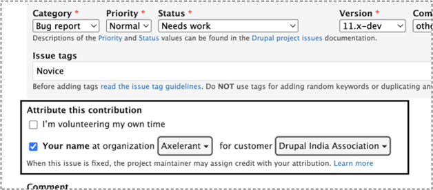

# Drupal Contribution

## How to start Contributions

### [Create a Drupal.org account](https://www.drupal.org/user/register)

- Confirm the new account (i.e., trusted colleagues)
- Fill out your profile information
  - Bio, picture, location, languages
  - Contributor roles
  - Events attended
  - Mentors
  - Developer: Git access
- Add your organization (Axelerant) to your profile.

### Working on issues

You can find all issues related to the module, theme, or Core in the sidebar of the project.

Before working on these issues, Read and understand the [issue etiquette documentation](https://www.drupal.org/issue-etiquette).

### [Understand the credit policy](https://www.drupal.org/core-credit-policy)

### Start with a novice task

These issues have been tagged by contributors and maintainers with the novice tag. These are good tasks for the first contribution. That means they’re easy to understand. Changes will be easily accepted and will give you a good, complete experience of the contribution process.

You should choose the first issue as an existing issue only.

[Read more](https://www.drupal.org/project/issues/novice)

### Be collaborative

Follow along with the existing contributions.

- If others are working on merge requests, you should work on merge requests.
- If you are proposing a new solution, you can create a new branch and create a merge request.
- You can switch to a Merge request from patches, but only if you’re making a change.
- Do not just convert an existing merge request without any other changes.
- Respect maintainer and other contributor feedback.
- Maintainers and other contributors will try to help you. But if you don’t respond to their feedback or go back and repeat the same problem in a different issue, that will be a problem.
- If the maintainer gives you feedback to do something differently, acknowledge the feedback and change your contribution style.
- If you don't follow the maintainer's feedback, you just risk a temporary ban.

### Attribute your work to Axelerant technologies

Don't forget to add Axelerant as your organization and Drupal India Association as your customer.

